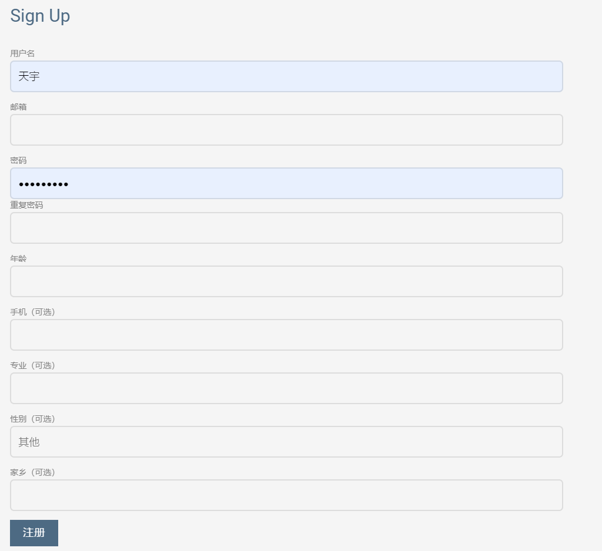
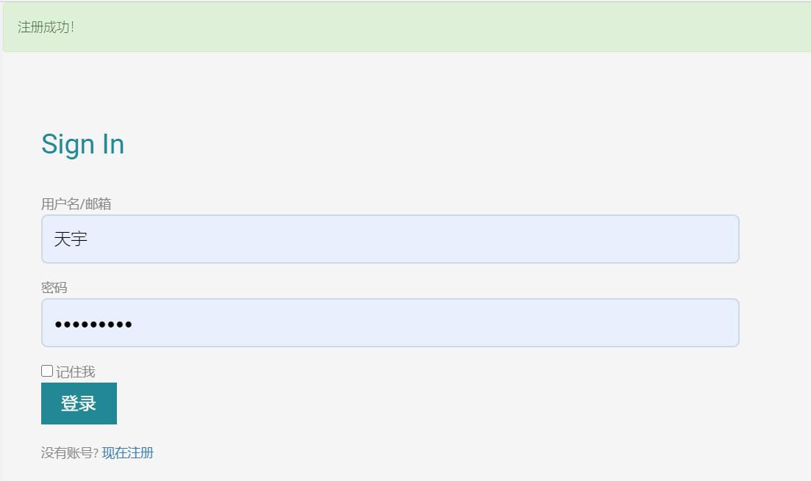
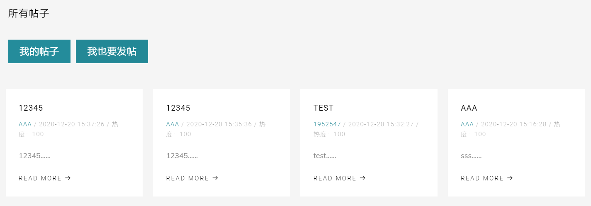
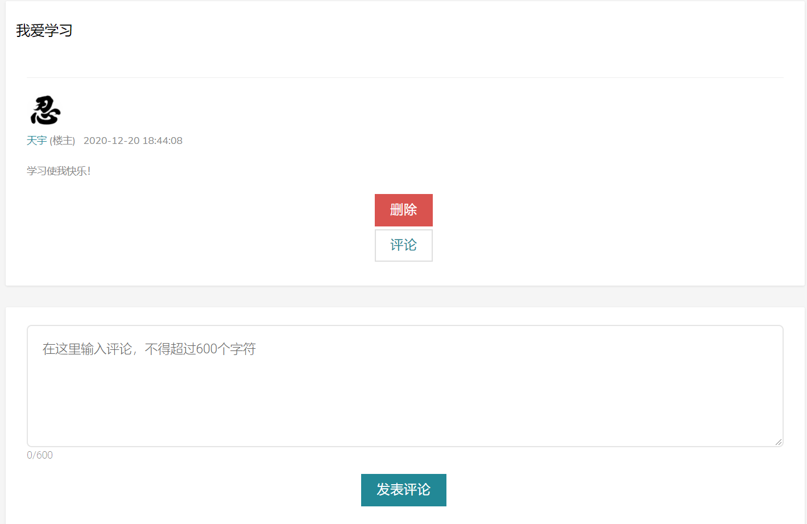
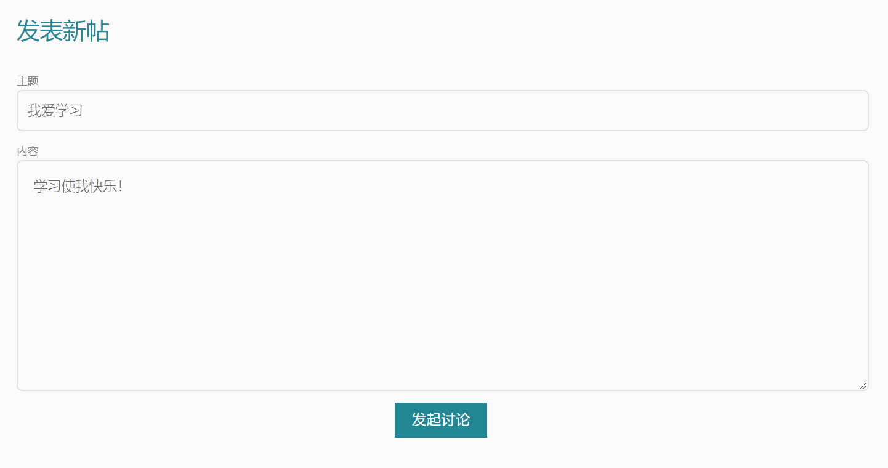

# 仰望心空——同济交友网站

开发&维护团队：2020计科导14组

仰望心空是一个基于flask架构的交友网站，其目的是面向同济大学学生提供一个认识新朋友的平台。本系统内置博客、论坛、线上聊天室、待办事项等功能，力求为广大同济学子提供一个良好的线上交友平台。

---

## 目录

- 安装部署
- 各部分功能说明
    - [x] 注册登录
    - [x] 个人中心
    - [x] 博客
    - [x] 论坛
    - [x] 好友与可能认识的人
    - [x] 线上聊天室
    - [x] 待办事项

- 开发说明

---

## 安装部署

### 环境

本项目基于python3的flask架构，需要安装者机器中包含python3环境。建议使用python3.7及以上的版本。

安装时首先使用命令行等工具转到项目文件夹（app.py所在的文件夹），然后安装依赖的python库。

建议运行以下命令安装项目所需的库，同时为避免冲突建议使用虚拟环境。

```
pip install -r requirements.txt
```

### 运行

安装完相应库后，在命令行（需先转入项目文件夹）中运行以下命令即可运行项目：
```
python app.py
```
项目正常启动后，按照命令行中提示用浏览器访问地址 http://127.0.0.1:5000/ 即可看到项目页面，此时网页为本地运行。

---

## 各部分功能说明

### 注册登录

##### 介绍

首先进入项目主页：


点击注册，注册时界面如下：


用户需要输入用户名、邮箱、密码、重复密码、年龄的信息，以及一些其他可选信息，注册完成后将跳转到登录页面：



点击登录进入主页，完成注册与登录过程。

需要指出的是，用户登录前后在页面导航栏以及主页显示的内容有所不同，有些不登录不能进行的功能将在注册后不予显示，而注册前的“登录、注册”按钮则相应变为“个人中心、注销”。


<!-- ##### TODO

登录处应该有忘记密码的选项，不过限于时间没做（最后一点时间才想起来这个功能...）

登录处的“记住我”是假的，并不能真正记住密码，应该考虑日后完成。

注册界面的年龄应改为生日并设定下拉菜单，以计算出用户的年龄，专业与家乡也最好改为下拉菜单的形式，避免瞎写。

希望日后能完成注册邮箱/短信验证

##### 感想

是我完成的第一个部分，本来以为会比较麻烦，也不知道如何判断是否登录，不过在了解到flask_login后完美解决一切问题，看来python还是能用库解决的不需要思考啊。

虽然现在看逻辑上没有很困难的地方，不过最初在做的时候因为前后端都看不懂真的是寸步难行，好不容易才写出来一个很难看的登录界面。

在写完这个之后，对于分包与前端扩展base.html有了许多新的认识，之后可以说进度就快多了。经过后来多次修改，登录注册也不是最初丑丑的样子了！

不过限于能力与时间，还是留下了不少遗憾，日后重构吧。 -->

### 个人中心

登录自己的个人中心可以维护头像和照片墙的照片。在上传照片时，会对照片进行检查，仅允许png和jpg格式的图片，并且限制所占内存大小，以保证安全性。我们还用了python的图片处理包对图像进行预处理，将图片尺寸统一，使页面统一美观。再没有图片时，会显示默认的图片

	个人中心分为两种模式（浏览自己的个人中心、浏览他人的个人中心），三部分功能（互动、展示、编辑）。
	根据不同的访问者类型，显示不同的模式，相应地展示不同的功能。
	功能说明:
		- 互动：点赞/关注
		- 展示：个人信息、个人介绍、头像、照片墙、最近博客
		- 编辑：更换头像、更改照片墙图片、编辑个人信息、进入博客中心

### 博客

博客可以上传图片。但是不足之处在于仅能上传三张图片，不能由用户自主决定上传的张数，有些遗憾

	博客有两个入口，一个是从主页进入，另一个从个人中心进入。
	同样也 根据不同的访问者类型，显示不同的模式，响应地展示不同的功能。
	功能说明:
		- 互动：浏览、点赞
		- 展示：博客列表，博客详细内容、博客配图
		- 编辑：写博客（同步至论坛、添加图片的博客）


### 论坛

##### 介绍

论坛主要由以下四个部分组成：

所有帖子：
我的帖子：
帖子详情：
发帖页面：

使用论坛功能需先登录，登陆后可点击相应按钮进行跳转，从而完成看帖、发帖等操作。

<!-- ##### TODO

论坛页面的热度是假的，这个是忘记修改了，其实改一下并不难。

头像显示不够美观。

对于帖子的恢复目前只能有一次，不能实现楼中楼。

帖子中不能支持图片，也没有markdown格式。

论坛与博客的联系有待提升。

###### 感想

这部分代码逻辑比较简单，但是由于我们组找的模板中并没有相应的css格式，因此我引入了其他的css，并由此真正对前端代码有了一点了解。

由于各方面参考资料充足，这部分完成相对容易。 -->


### 好友列表

    加载好友列表，包括关注我的人和我关注的人
    从这里进入好友的个人中心
    推荐陌生人朋友功能

### 聊天室

    在线聊天室，数据库直接交互实现
    左侧加载好友列表，按照最近消息时间排序
    点击切换窗口和其他好友聊天

### 待办事项

#### 页面显示
数据库中的记录将通过表格显示在网页上, 可以进行拖拽排序

#### ADD功能
可以添加一项事件, 最多支持32个

---

## 开发说明

### 项目目录结构
```
│  app.py       //注册蓝图与项目运行
│  config.py    //联系数据库
│  data.db      //数据库
│  db_create.py //建立数据库
│  
├─app
│  │  __init__.py
│  │  
│  ├─account_manage //登录注册
│  │  │  forms.py
│  │  │  models.py
│  │  │  tools.py
│  │  │  views.py
│  │  │  __init__.py 
│  │          
│  ├─bbs            //论坛
│  │  │  forms.py
│  │  │  models.py
│  │  │  views.py
│  │  │  __init__.py
│  │          
│  ├─chatroom       //聊天室
│  │  │  forms.py
│  │  │  models.py
│  │  │  views.py
│  │  │  __init__.py
│  │          
│  ├─focus_manage   //好友列表
│  │  │  models.py
│  │  │  views.py
│  │  │  __init__.py
│  │          
│  ├─myblog         //博客
│  │  │  forms.py
│  │  │  models.py
│  │  │  views.py
│  │  │  __init__.py
│  │          
│  ├─mycenter       //个人中心
│  │  │  forms.py
│  │  │  models.py
│  │  │  picture.py
│  │  │  views.py
│  │  │  __init__.py
│  │          
│  ├─static         //静态文件
│  │  ├─css
│  │  │      
│  │  ├─fonts
│  │  │          
│  │  ├─images
│  │  │      
│  │  ├─js
│  │  │          
│  │  └─sass
│  │                  
│  ├─templates      //html模板
│  │      
│  ├─todolist       //待办事项
│  │  │  forms.py
│  │  │  models.py
│  │  │  views.py
│  │  │  __init__.py   
```    

### 小组成员&维护者&分工（字典序）

- 戴浏 —— 前端
- 范千惠 —— 个人中心&博客
- 高志成 —— 前端
- 姜星宇 —— 待办事项
- 孔艺菲 —— 所有图片的处理、维护和展示
- 田宇 —— 登陆注册&论坛
- 王上游 —— 好友列表&线上聊天室

<!-- ### 其他说明

1. 项目表单采用wtform，数据库采用sqlite，后端基本全由python完成。

2. 目前项目中数据库构造函数仍有欠缺，每次更新任一models都会导致数据库出问题，需要删库重建，原因是没有考虑数据库版本更新问题，日后重构。

3. 本次开发小组内未使用git管理版本，而是基于QQ群的版本管理模式，造成一定混乱，今后一定要学会git！

4. 未部署到网络服务器，也没有邮箱验证，日后重构。

### 特别鸣谢

特别鸣谢刘孔阳、范正源、李博宇等人对本项目提供的技术帮助！ -->